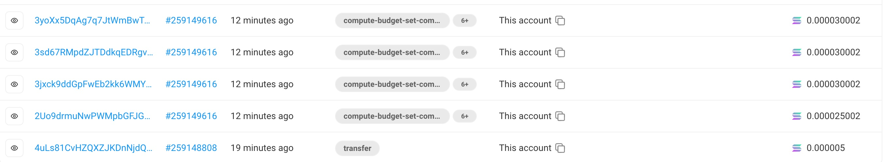

# ore-cli

魔改官方版本,用 golang 重写

特点:

- 无需卷 gas, 内置 jito 小费打赏, 感受史无前例的快速上链
- 支持多号批量挖矿, 一次性提交多个号
- 支持批量激活账号, 批量领取奖励, 批量归集代币

# Usage

## =======先看这里=======

### 本程序花费大量时间成本, 重写和测试的代码上万行, 每次提交挖矿成功会自动打赏 0.0002 sol 作为小费给作者. 如果介意请不要使用

### 首先需要新建一个 wallet.txt 文件, 里面存放私钥地址, 一行一个, 以下命名默认执行该文件中的所有账号.

### 以挖矿举例, 如果 wallet.txt 里有 20 个私钥, 执行批量挖矿后, 会等待算出这 20 个账号的所有结果之后, 才会批量拆分成 5 个 tx 一起提交. 请注意私钥数量, 放太多可能会影响整体效率, 20 个最好

### 默认会使用第一个私钥账号作为付 gas 的地址, 请保证余额充足



### tipFee 参数是给验证者的小费, 跟作者无关! 如果设置太小可能不会上链, 设置太大可能会亏钱, 请根据实际情况自己测试

## =====================

# Command

### ore-cli 是 linux 版本

### ore-cli.exe 是 windows 版本

### ore-cli-mac 是 m 系列 mac 版本

### 请根据不同的系统,替换成下面的执行命令

### 如果是新账号第一次挖矿,需要先要执行账号注册

批量注册命令

```
./ore-cli register --rpc xxx --tipFee 0.0003
```

批量挖矿命令

```
./ore-cli mine --rpc xxx --tipFee 0.0004
```

批量领取命令

```
./ore-cli claim --rpc xxx --tipFee 0.0003
```

批量归集命令, 此命令没有内置小费, 会自动检测代币余额, 没有到账的多执行几次即可

```
./ore-cli token-transfer --rpc xxx --fee 20000 --to 你的钱包地址
```

批量查余额

```
./ore-cli balance --rpc xxx
```
